<!-- LOGO & TITLE -->
<p align="center">
  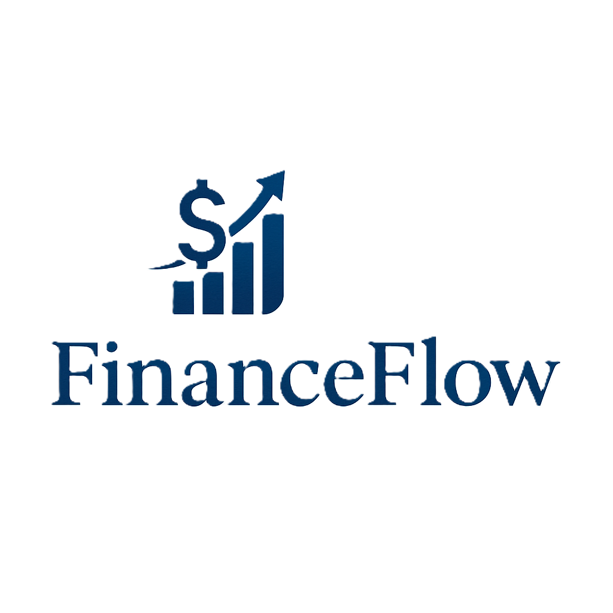
</p>

<h1 align="center">💸 FinanceFlow</h1>
<p align="center">
  <b>Personal Money Tracker Website</b><br>
  Built with Laravel · Tailwind CSS · JavaScript · Chart.js · MySQL
</p>

---

<!-- INTRO -->
## ✨ Overview

**FinanceFlow** is a modern and user-friendly personal finance tracker built with **Laravel**, **Tailwind CSS**, **JavaScript**, **Chart.js**, and **MySQL**.

It’s designed to help individuals:
- ✅ Track income & expenses
- ✅ Manage multiple wallets & budgets
- ✅ Set savings goals
- ✅ Visualize financial insights in a sleek dashboard

---

<!-- FEATURES -->
## 🚀 Key Features

### 📊 Dashboard
- Clean, responsive interface with a consistent theme
- Widgets showing balances, spending, and transactions
- Dynamic Chart.js graphs for:
  - Income vs Expenses (1–12 months)
  - Spending per category
  - Budget vs Actual
  - Wallet distributions

### 💼 Wallet
- Stylish card layout for each wallet
- Real-time balance display
- Searchable and filterable transaction list

### 🐷 Piggy Bank
- Visual savings goal tracker
- Animated progress bars and icons
- Easily add/edit goals

### 📈 Analytics
- Pie, bar, and line charts for in-depth analysis
- Filter by time range, category, or wallet
- Smart recommendations based on user habits

### ⚙️ Settings
- Update profile and preferences

### 🔐 Auth System
- Minimalist login and registration UI
- Step-based onboarding
- Email-based password recovery
- **(Coming Soon)** Social login (Google, Facebook)

---

<!-- BUILT WITH -->
## 🧑‍💻 Built With

| Tech       | Description                     |
|------------|---------------------------------|
| [Laravel](https://laravel.com/) | Backend framework |
| [Tailwind CSS](https://tailwindcss.com/) | Utility-first CSS |
| [Chart.js](https://www.chartjs.org/) | Charts and graphs |
| [MySQL](https://www.mysql.com/) | Relational database |

---

## 📸 Screenshots

---

### 🖥️ Dashboard
<p align="center">
  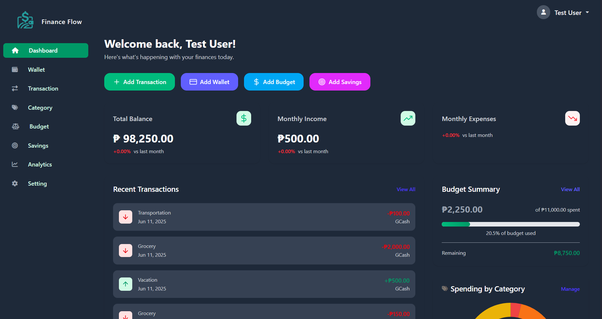
  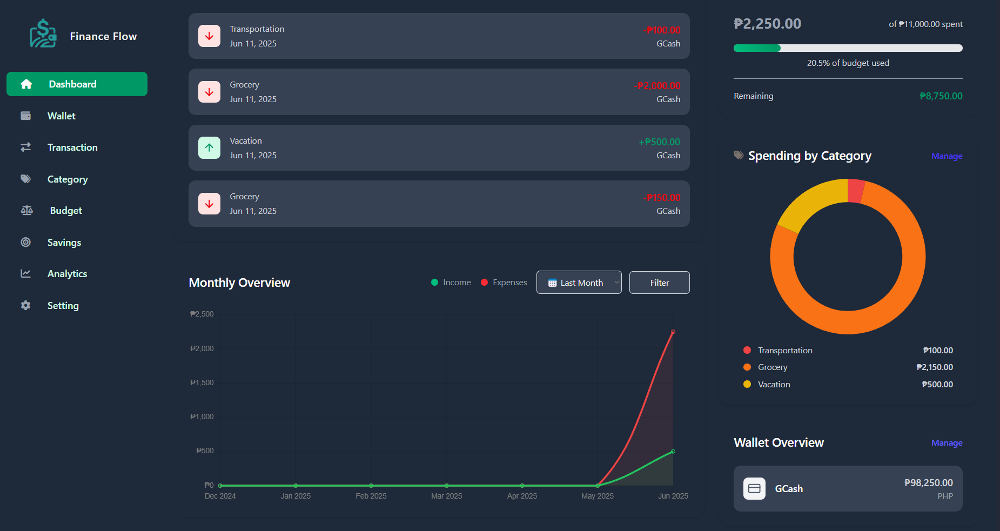
</p>

---

### 💼 Wallet
<p align="center">
  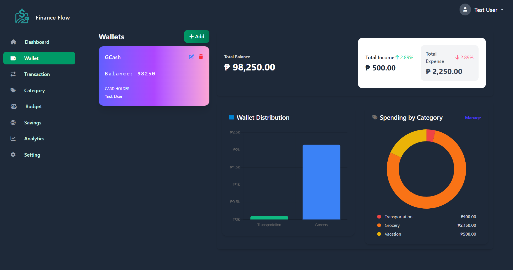
</p>

---

### 📄 Transactions & 🗂️ Categories
<p align="center">
  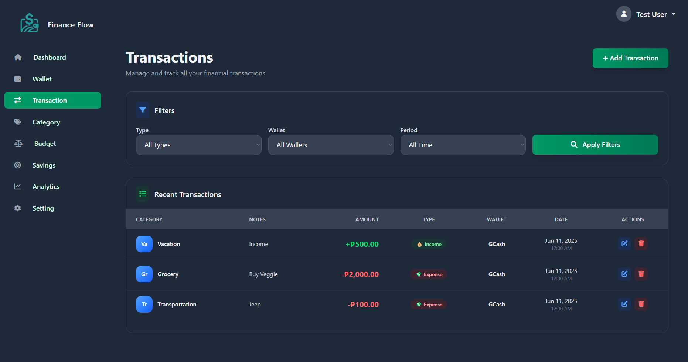
  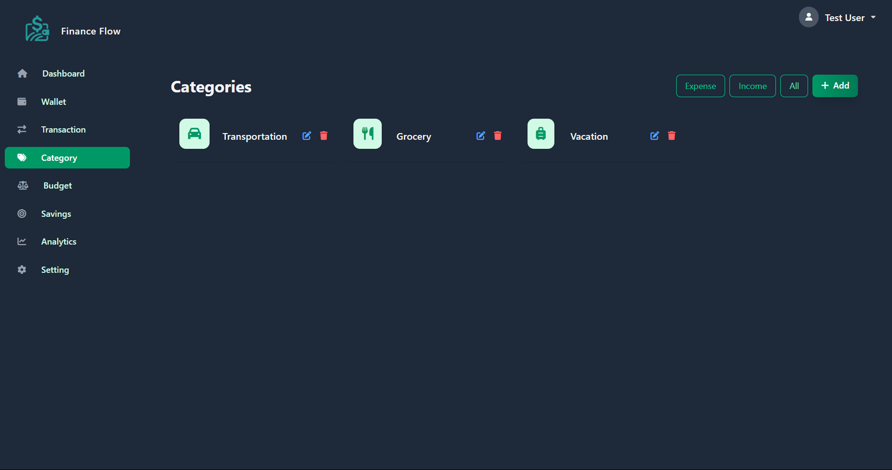
</p>

---

### 📊 Budget & 🐷 Savings
<p align="center">
  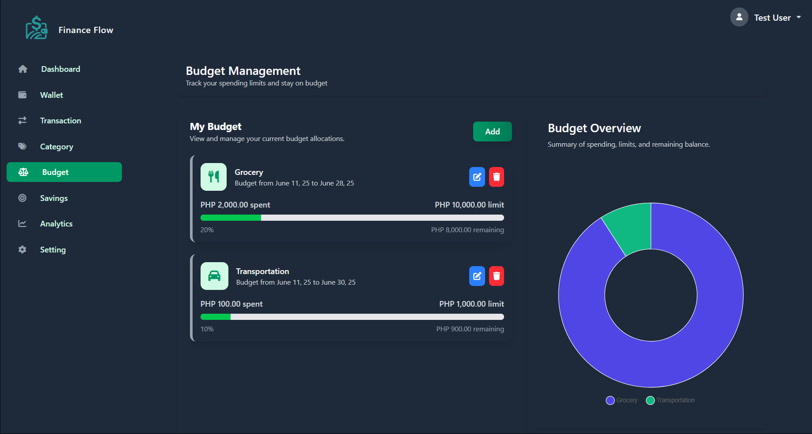
  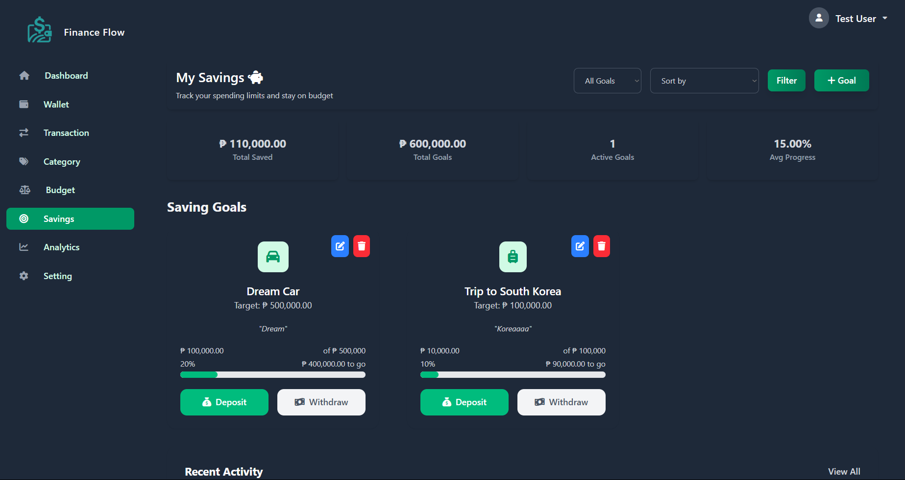
</p>

---

### 📈 Analytics
<p align="center">
  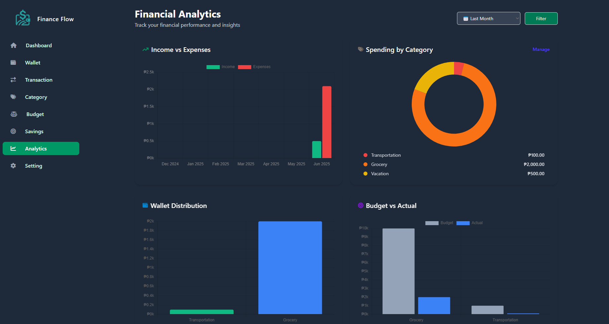
  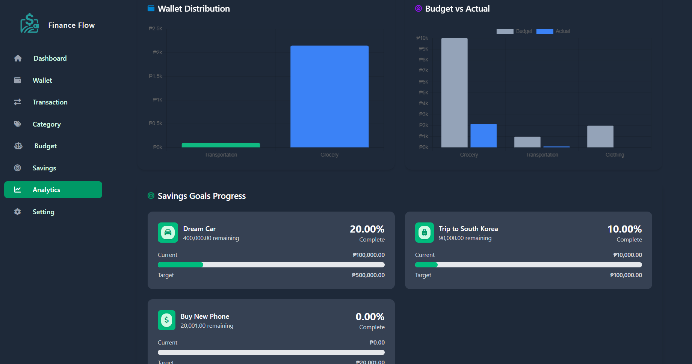
</p>

---

### ⚙️ Settings
<p align="center">
  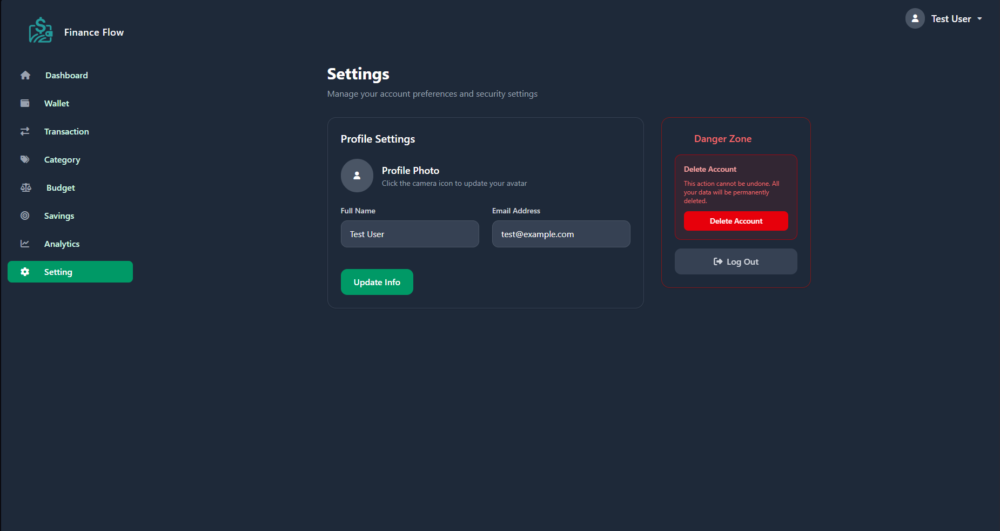
</p>


---

<!-- INSTALLATION -->
## ⚙️ Installation

```bash
# Clone the repository
git clone https://github.com/CJcode6754/FinanceFlow.git

# Navigate into the project
cd FinanceFlow

# Install PHP dependencies
composer install

# Install JS dependencies
npm install

# Copy .env and configure
cp .env.example .env

# Generate application key
php artisan key:generate

# Set your DB credentials in `.env`

# Run migrations
php artisan migrate

# Build frontend assets
npm run dev

# Start local server
php artisan serve
